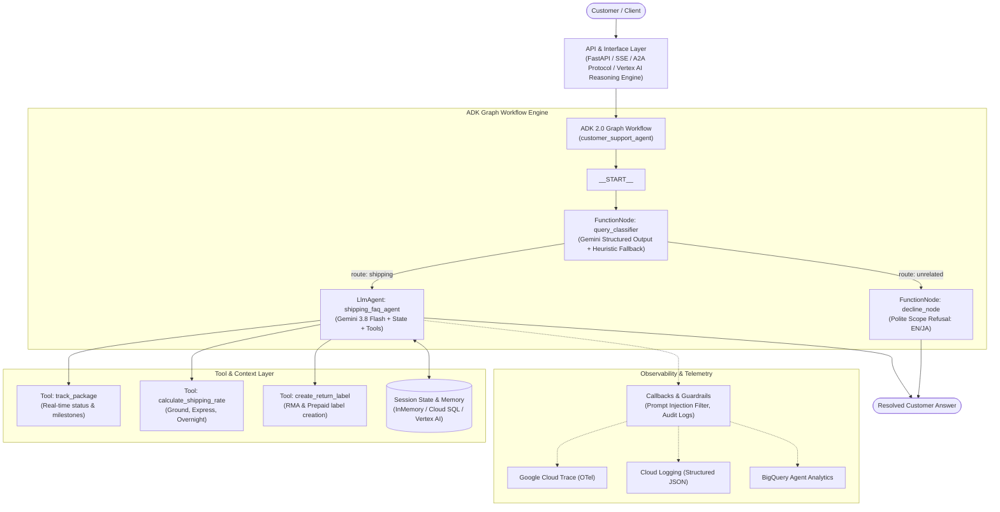

# Logistics Customer Support Agent (ADK 2.0)

[](https://github.com/ishidahra01/adk-agent-assessment/actions/workflows/ci.yml)
[](LICENSE)
[](https://google.github.io/adk-docs/)

An intelligent enterprise-grade customer support agent for shipping and logistics built with **Google Agent Development Kit (ADK 2.0)**, **Gemini 3.8 Flash**, and **Vertex AI**.

---

## 🎯 Problem and Solution

- **The Problem**: E-commerce and parcel logistics companies face immense volumes of repetitive customer inquiries regarding package tracking, shipping rate estimates, delivery rescheduling, and return requests. Human support agents spend over 60% of their time performing repetitive manual lookups across fragmented systems, causing high wait times and operational costs.
- **The Solution**: An automated, context-aware **Logistics Customer Support Agent** that combines deterministic graph orchestration, real-time tool calling, session context memory, and safety guardrails. The agent handles end-to-end inquiry resolution in both English and Japanese while politely declining off-topic queries and maintaining strict enterprise safety boundaries.

---

## 🏛️ Architecture & Orchestration



---

## 📋 Evaluation Criteria Mapping (95 Points Total)

This repository is built to strictly align with the **Ai in 5 Days Assessment** criteria:

| Evaluation Dimension | Weight | Implementation Details in This Repository |
| :--- | :---: | :--- |
| **Tool & Interface Design** | Max Score | • **Tools** in [`app/tools/shipping_tools.py`](app/tools/shipping_tools.py): `track_package`, `calculate_shipping_rate`, and `create_return_label` with strict type annotations, docstrings, and JSON responses.<br/>• **Interfaces** in [`app/fast_api_app.py`](app/fast_api_app.py): REST API, SSE streaming, A2A protocol endpoint (`/a2a/app`), and Vertex AI Reasoning Engine Adapter. |
| **Context & Memory** | Max Score | • **Session State**: [`app/callbacks.py`](app/callbacks.py) initializes session state (`interaction_count`, `customer_profile`).<br/>• **Context Persistence**: Tools automatically persist tracking numbers, rate quotes, and RMA numbers into `tool_context.state` for seamless multi-turn follow-ups.<br/>• **Tests**: Full test coverage in [`tests/unit/test_callbacks_and_memory.py`](tests/unit/test_callbacks_and_memory.py). |
| **Orchestration & Logic** | Max Score | • **Graph Workflow**: Built with ADK 2.0 `google.adk.workflow.Workflow` with conditional routing edges.<br/>• **Classification & Fallback**: LLM structured output (`QueryClassification`) backed by multi-lingual regex heuristic fallbacks.<br/>• **Guardrails**: Prompt injection defense in `guardrail_before_model` callback. |
| **Observability & Tracing** | Max Score | • **OpenTelemetry**: Native Cloud Trace export configured in `fast_api_app.py`.<br/>• **Structured Logging**: Pre- and post-tool lifecycle logging in `app/callbacks.py`.<br/>• **Telemetry Infrastructure**: Terraform resources in `deployment/terraform/single-project/telemetry.tf` (BigQuery dataset & log sinks).<br/>• **Evaluation Datasets**: [`customer_support_eval_set.json`](customer_support_eval_set.json) and [`customer_support_tools_eval_set.json`](customer_support_tools_eval_set.json). |
| **Infrastructure & CI/CD** | Max Score | • **CI Pipeline**: [`.github/workflows/ci.yml`](.github/workflows/ci.yml) executes linting (`ruff`), unit testing (`pytest`), and Docker build verification.<br/>• **CD Pipeline**: [`.github/workflows/deploy.yml`](.github/workflows/deploy.yml) for automated Cloud Run deployments.<br/>• **Containerization**: Optimized [`Dockerfile`](Dockerfile) with `uv` multi-stage installation.<br/>• **Terraform**: Production-ready IaC in [`deployment/terraform/`](deployment/terraform/). |

---

## 🚀 Quick Start

### 1. Prerequisites
- Python 3.11, 3.12, or 3.13
- `uv` (recommended package manager): `curl -LsSf https://astral.sh/uv/install.sh | sh`
- Google Cloud project with Vertex AI enabled (or `GEMINI_API_KEY`)

### 2. Setup Environment
```bash
# Clone the repository
git clone https://github.com/ishidahra01/adk-agent-assessment.git
cd adk-agent-assessment

# Copy environment template
cp .env.example .env
# Edit .env with your GCP project ID or GEMINI_API_KEY
```

### 3. Install Dependencies
```bash
uv sync --extra lint --extra eval
```

### 4. Run Tests & Linter
```bash
# Run unit tests
uv run pytest tests/unit

# Run linter
uv run --extra lint ruff check app tests
```

### 5. Launch Locally
```bash
# Start FastAPI backend server
uv run uvicorn app.fast_api_app:app --host 0.0.0.0 --port 8000
```
Open your browser to `http://localhost:8000/docs` to test endpoints via Swagger UI.

---

## 🧪 Evaluation & Quality Benchmarks

Run evaluations using the built-in evaluation datasets:
```bash
# Run response quality evaluation
uv run pytest tests/eval/response_quality.py
```

Eval datasets included:
- `customer_support_eval_set.json`: Multi-turn dialogue scenarios covering tracking, rates, returns, and off-topic declines.
- `customer_support_tools_eval_set.json`: Tool execution accuracy benchmarks.
- `eval_config.json`: LLM-as-a-judge rubrics evaluating relevance, scope adherence, policy accuracy, and courtesy.

---

## 📦 Deployment

### Cloud Run Deployment via Terraform
```bash
cd deployment/terraform/single-project
terraform init
terraform plan
terraform apply
```

### Direct Docker Container Run
```bash
docker build -t customer-support-agent:latest .
docker run -p 8080:8080 --env-file .env customer-support-agent:latest
```

---

## 📄 License
This project is licensed under the Apache 2.0 License - see the [LICENSE](LICENSE) file for details.
